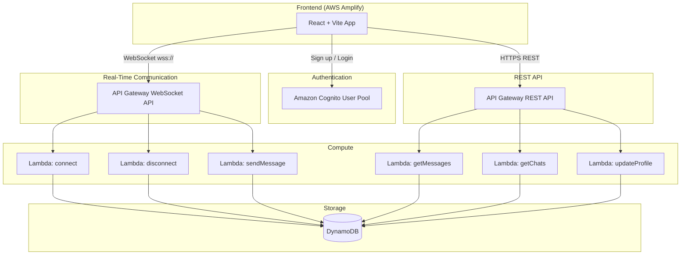

# QuickChat — Full-Stack Real-Time Chat Application

A modern, serverless, real-time one-to-one chat application built with React + Vite + Tailwind CSS on the frontend and AWS services (Lambda, API Gateway WebSocket, DynamoDB, Cognito) on the backend.

## AWS Architecture & Data Flow



### Data Flow

1. **Auth Flow** — User signs up / logs in via Amazon Cognito. The frontend receives JWT tokens (ID, access, refresh). All API calls are authenticated with the JWT.
2. **WebSocket Flow** — On login, the client opens a WebSocket connection to API Gateway. The `$connect` route triggers a Lambda that stores the `connectionId` + `userId` in the Connections table. Messages are sent via the `sendMessage` action, and the Lambda pushes the message to the recipient's active connection in real-time. On disconnect, the connection record is removed.
3. **REST Flow** — Historical data (chat list, message history, profile updates) is fetched via REST endpoints backed by Lambda + DynamoDB.

---

## DynamoDB Table Designs

### Users Table
| Attribute | Type | Key |
|---|---|---|
| userId (PK) | String | Partition Key |
| email | String | — |
| displayName | String | — |
| avatarUrl | String | — |
| status | String | online/offline |
| createdAt | String (ISO) | — |

### Conversations Table
| Attribute | Type | Key |
|---|---|---|
| conversationId (PK) | String | Partition Key |
| participants | List<String> | — |
| lastMessage | String | — |
| lastMessageAt | String (ISO) | — |
| createdAt | String (ISO) | — |

**GSI**: `UserConversationsIndex` — PK: `userId`, SK: `lastMessageAt` (to query all conversations for a user, sorted)

### Messages Table
| Attribute | Type | Key |
|---|---|---|
| conversationId (PK) | String | Partition Key |
| messageId (SK) | String | Sort Key (ULID for time-ordering) |
| senderId | String | — |
| content | String | — |
| timestamp | String (ISO) | — |
| type | String | text/image |

### Connections Table
| Attribute | Type | Key |
|---|---|---|
| connectionId (PK) | String | Partition Key |
| userId | String | — |
| connectedAt | String (ISO) | — |

**GSI**: `UserConnectionIndex` — PK: `userId` (to find connection by userId)

---

## Project Folder Structure

```
QuickChat/
├── frontend/
│   ├── public/
│   │   └── favicon.svg
│   ├── src/
│   │   ├── assets/
│   │   │   └── logo.svg
│   │   ├── components/
│   │   │   ├── auth/
│   │   │   │   ├── LoginForm.jsx
│   │   │   │   ├── SignupForm.jsx
│   │   │   │   └── AuthTabs.jsx
│   │   │   ├── chat/
│   │   │   │   ├── ChatList.jsx
│   │   │   │   ├── ChatListItem.jsx
│   │   │   │   ├── ChatWindow.jsx
│   │   │   │   ├── MessageBubble.jsx
│   │   │   │   ├── MessageInput.jsx
│   │   │   │   ├── TypingIndicator.jsx
│   │   │   │   └── ChatHeader.jsx
│   │   │   ├── layout/
│   │   │   │   ├── Sidebar.jsx
│   │   │   │   └── AppLayout.jsx
│   │   │   ├── profile/
│   │   │   │   └── ProfileSettings.jsx
│   │   │   └── common/
│   │   │       ├── Avatar.jsx
│   │   │       ├── Badge.jsx
│   │   │       ├── LoadingSpinner.jsx
│   │   │       └── EmptyState.jsx
│   │   ├── context/
│   │   │   ├── AuthContext.jsx
│   │   │   ├── ChatContext.jsx
│   │   │   └── WebSocketContext.jsx
│   │   ├── hooks/
│   │   │   ├── useAuth.js
│   │   │   ├── useChat.js
│   │   │   └── useWebSocket.js
│   │   ├── pages/
│   │   │   ├── AuthPage.jsx
│   │   │   ├── ChatPage.jsx
│   │   │   └── ProfilePage.jsx
│   │   ├── services/
│   │   │   ├── api.js
│   │   │   ├── auth.js
│   │   │   └── websocket.js
│   │   ├── utils/
│   │   │   ├── constants.js
│   │   │   ├── formatters.js
│   │   │   └── validators.js
│   │   ├── data/
│   │   │   └── mockData.js
│   │   ├── App.jsx
│   │   ├── App.css
│   │   ├── index.css
│   │   └── main.jsx
│   ├── index.html
│   ├── tailwind.config.js
│   ├── postcss.config.js
│   ├── vite.config.js
│   └── package.json
│
├── backend/
│   ├── lambdas/
│   │   ├── connect/
│   │   │   └── index.mjs
│   │   ├── disconnect/
│   │   │   └── index.mjs
│   │   ├── sendMessage/
│   │   │   └── index.mjs
│   │   ├── getMessages/
│   │   │   └── index.mjs
│   │   ├── getChats/
│   │   │   └── index.mjs
│   │   └── updateProfile/
│   │       └── index.mjs
│   ├── shared/
│   │   ├── dynamodb.mjs
│   │   └── response.mjs
│   ├── template.yaml          # SAM template
│   └── package.json
│
├── .env.example
├── amplify.yml
└── README.md
```

---

## Dependencies

### Frontend (`frontend/package.json`)

| Package | Purpose |
|---|---|
| react, react-dom | UI library |
| react-router-dom | Client-side routing |
| amazon-cognito-identity-js | Cognito auth SDK |
| lucide-react | Modern icon library |
| date-fns | Date formatting |
| uuid | Generate unique IDs |

**Dev dependencies**: vite, @vitejs/plugin-react, tailwindcss, postcss, autoprefixer, eslint

### Backend (`backend/package.json`)

| Package | Purpose |
|---|---|
| @aws-sdk/client-dynamodb | DynamoDB client |
| @aws-sdk/lib-dynamodb | DynamoDB document client |
| @aws-sdk/client-apigatewaymanagementapi | Push messages to WebSocket clients |
| uuid | Generate IDs |

---

## Proposed Changes

### Frontend Setup

#### [NEW] [package.json](file:///c:/Users/jyoti/OneDrive/Desktop/Quickchat/frontend/package.json)
Initialize React + Vite project via `npx create-vite`. Install Tailwind CSS v3, react-router-dom, lucide-react, amazon-cognito-identity-js, date-fns, uuid.

#### [NEW] [index.css](file:///c:/Users/jyoti/OneDrive/Desktop/Quickchat/frontend/src/index.css)
Global styles: Tailwind directives, custom CSS variables for the dark theme palette (`#1A1F36`, `#4A90E2`, etc.), scrollbar styling, custom animations.

#### [NEW] [tailwind.config.js](file:///c:/Users/jyoti/OneDrive/Desktop/Quickchat/frontend/tailwind.config.js)
Extend Tailwind with custom colors (`navy`, `electric-blue`, `dark-surface`, `dark-card`), custom fonts, and animation keyframes.

---

### Authentication Screen

#### [NEW] [AuthPage.jsx](file:///c:/Users/jyoti/OneDrive/Desktop/Quickchat/frontend/src/pages/AuthPage.jsx)
Full-page centered card with QuickChat logo, tab switcher between Login/Signup, and form validation.

#### [NEW] [LoginForm.jsx](file:///c:/Users/jyoti/OneDrive/Desktop/Quickchat/frontend/src/components/auth/LoginForm.jsx)
Email + password fields, "Sign In" CTA, loading state, error display.

#### [NEW] [SignupForm.jsx](file:///c:/Users/jyoti/OneDrive/Desktop/Quickchat/frontend/src/components/auth/SignupForm.jsx)
Name + email + password + confirm password fields, "Create Account" CTA, validation.

#### [NEW] [AuthContext.jsx](file:///c:/Users/jyoti/OneDrive/Desktop/Quickchat/frontend/src/context/AuthContext.jsx)
Context for current user, login/signup/logout functions. Integrates with `amazon-cognito-identity-js`. Falls back to mock auth for local demo.

---

### Chat List / Home Screen

#### [NEW] [ChatPage.jsx](file:///c:/Users/jyoti/OneDrive/Desktop/Quickchat/frontend/src/pages/ChatPage.jsx)
Main layout: responsive sidebar + chat window. Desktop shows both side-by-side; mobile toggles.

#### [NEW] [Sidebar.jsx](file:///c:/Users/jyoti/OneDrive/Desktop/Quickchat/frontend/src/components/layout/Sidebar.jsx)
User profile summary, search bar, list of `ChatListItem` components.

#### [NEW] [ChatListItem.jsx](file:///c:/Users/jyoti/OneDrive/Desktop/Quickchat/frontend/src/components/chat/ChatListItem.jsx)
Avatar, username, last message preview, timestamp, unread badge.

---

### Active Chat Screen

#### [NEW] [ChatWindow.jsx](file:///c:/Users/jyoti/OneDrive/Desktop/Quickchat/frontend/src/components/chat/ChatWindow.jsx)
Conversation header, scrollable message area, auto-scroll, message input.

#### [NEW] [MessageBubble.jsx](file:///c:/Users/jyoti/OneDrive/Desktop/Quickchat/frontend/src/components/chat/MessageBubble.jsx)
Distinct styles for incoming/outgoing messages, timestamps, delivery indicators.

#### [NEW] [MessageInput.jsx](file:///c:/Users/jyoti/OneDrive/Desktop/Quickchat/frontend/src/components/chat/MessageInput.jsx)
Text input, send button, attachment icon, Enter-to-send.

#### [NEW] [TypingIndicator.jsx](file:///c:/Users/jyoti/OneDrive/Desktop/Quickchat/frontend/src/components/chat/TypingIndicator.jsx)
Animated dots indicator.

---

### Profile & Settings Screen

#### [NEW] [ProfilePage.jsx](file:///c:/Users/jyoti/OneDrive/Desktop/Quickchat/frontend/src/pages/ProfilePage.jsx)
Route to profile settings.

#### [NEW] [ProfileSettings.jsx](file:///c:/Users/jyoti/OneDrive/Desktop/Quickchat/frontend/src/components/profile/ProfileSettings.jsx)
Editable display name, avatar upload placeholder, change password, notification toggle, dark/light mode toggle, logout button.

---

### State & Services

#### [NEW] [ChatContext.jsx](file:///c:/Users/jyoti/OneDrive/Desktop/Quickchat/frontend/src/context/ChatContext.jsx)
Manages conversations list, active conversation, messages. Provides `sendMessage`, `selectConversation`, etc.

#### [NEW] [WebSocketContext.jsx](file:///c:/Users/jyoti/OneDrive/Desktop/Quickchat/frontend/src/context/WebSocketContext.jsx)
Manages WebSocket connection lifecycle, reconnection logic, and event dispatching.

#### [NEW] [mockData.js](file:///c:/Users/jyoti/OneDrive/Desktop/Quickchat/frontend/src/data/mockData.js)
Realistic sample conversations, messages, and user profiles for demo mode (so the app works without AWS backend).

---

### Common Components

#### [NEW] [Avatar.jsx](file:///c:/Users/jyoti/OneDrive/Desktop/Quickchat/frontend/src/components/common/Avatar.jsx)
Reusable avatar with online indicator dot, fallback initials.

#### [NEW] [Badge.jsx](file:///c:/Users/jyoti/OneDrive/Desktop/Quickchat/frontend/src/components/common/Badge.jsx)
Unread message count badge.

#### [NEW] [LoadingSpinner.jsx](file:///c:/Users/jyoti/OneDrive/Desktop/Quickchat/frontend/src/components/common/LoadingSpinner.jsx)
Animated spinner for loading states.

#### [NEW] [EmptyState.jsx](file:///c:/Users/jyoti/OneDrive/Desktop/Quickchat/frontend/src/components/common/EmptyState.jsx)
Placeholder for empty chat / no conversations selected.

---

### Backend — Lambda Handlers

#### [NEW] [connect/index.mjs](file:///c:/Users/jyoti/OneDrive/Desktop/Quickchat/backend/lambdas/connect/index.mjs)
Store `connectionId` + `userId` in Connections table. Set user status to "online" in Users table.

#### [NEW] [disconnect/index.mjs](file:///c:/Users/jyoti/OneDrive/Desktop/Quickchat/backend/lambdas/disconnect/index.mjs)
Remove connection record. Set user status to "offline".

#### [NEW] [sendMessage/index.mjs](file:///c:/Users/jyoti/OneDrive/Desktop/Quickchat/backend/lambdas/sendMessage/index.mjs)
Parse message payload, write to Messages table, update Conversation's `lastMessage`, push message to recipient's WebSocket connection via API Gateway Management API.

#### [NEW] [getMessages/index.mjs](file:///c:/Users/jyoti/OneDrive/Desktop/Quickchat/backend/lambdas/getMessages/index.mjs)
Query Messages table by `conversationId`, return paginated results.

#### [NEW] [getChats/index.mjs](file:///c:/Users/jyoti/OneDrive/Desktop/Quickchat/backend/lambdas/getChats/index.mjs)
Query Conversations table for all conversations where user is a participant.

#### [NEW] [updateProfile/index.mjs](file:///c:/Users/jyoti/OneDrive/Desktop/Quickchat/backend/lambdas/updateProfile/index.mjs)
Update user's displayName, avatarUrl in Users table.

#### [NEW] [shared/dynamodb.mjs](file:///c:/Users/jyoti/OneDrive/Desktop/Quickchat/backend/shared/dynamodb.mjs)
Shared DynamoDB document client configuration.

#### [NEW] [template.yaml](file:///c:/Users/jyoti/OneDrive/Desktop/Quickchat/backend/template.yaml)
AWS SAM template defining all Lambda functions, DynamoDB tables, API Gateway WebSocket API, REST API, IAM roles.

---

### Deployment & Documentation

#### [NEW] [.env.example](file:///c:/Users/jyoti/OneDrive/Desktop/Quickchat/.env.example)
Template with `VITE_COGNITO_USER_POOL_ID`, `VITE_COGNITO_CLIENT_ID`, `VITE_WEBSOCKET_URL`, `VITE_API_URL`.

#### [NEW] [amplify.yml](file:///c:/Users/jyoti/OneDrive/Desktop/Quickchat/amplify.yml)
AWS Amplify build specification for the frontend.

#### [NEW] [README.md](file:///c:/Users/jyoti/OneDrive/Desktop/Quickchat/README.md)
Project overview, architecture diagram, setup instructions, AWS deployment guide, local development guide.

---

## User Review Required

> [!IMPORTANT]
> **Demo Mode**: The app will work fully in "demo mode" using mock data so you can see all screens immediately without deploying AWS services. Real AWS integration requires deploying the backend and configuring environment variables.

> [!NOTE]
> **Tailwind v3**: The user requested Tailwind CSS. I'll use **Tailwind CSS v3** as it's the most stable and widely supported version. Let me know if you'd prefer v4.

---

## Verification Plan

### Automated Tests
1. Run `npm run dev` in the `frontend/` directory and verify the dev server starts without errors
2. Check for build errors with `npm run build`

### Browser Verification
1. Open the app in the browser at `http://localhost:5173`
2. Verify the **Auth Screen** renders with login/signup tabs, form fields, and QuickChat branding
3. Log in with mock credentials and verify navigation to the **Chat List** screen
4. Verify the sidebar shows conversation list with avatars, previews, and timestamps
5. Select a conversation and verify the **Active Chat** screen shows message history with proper bubbles
6. Send a message and verify it appears in the chat (mock mode)
7. Navigate to the **Profile** screen and verify all settings render
8. Test responsive behavior by resizing the browser window
9. Capture screenshots of all four screens

### Manual Verification (by user)
- Deploy the backend using `sam deploy` and verify Lambda + DynamoDB tables are created
- Configure `.env` with real Cognito/API Gateway values and test real authentication
- Test real-time messaging between two browser tabs
